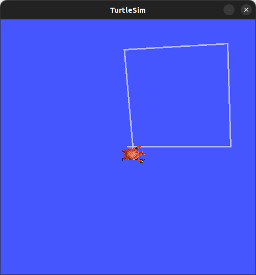

# ROS2 TurtleSim Square Controller  
*By Ashalen Govender*  

## How It Works  
Controls the turtle using ROS2 Twist messages:  
- Moves forward for set duration  
- Turns 90 degrees  
- Repeats 4 times

## Result 
  

## Debugging  
**Problem**: Wasn't making perfect squares  
**Solution**:  
- Adjusted turn time from 1.57s → 1.62s  
- Added precise timing control  

## Usage(run in different terminals)  
    ros2 run turtlesim turtlesim_node  
    ros2 run turtlesim_controller draw_square 
    

## Future Improvements  
- Add pose feedback  
- Support more shapes  
- Create launch files  

---

Apache 2.0 License
